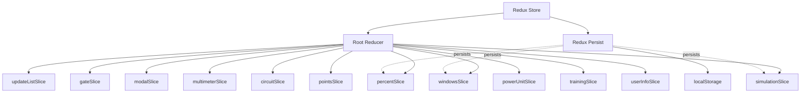
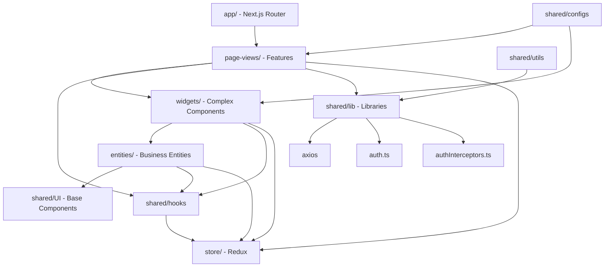
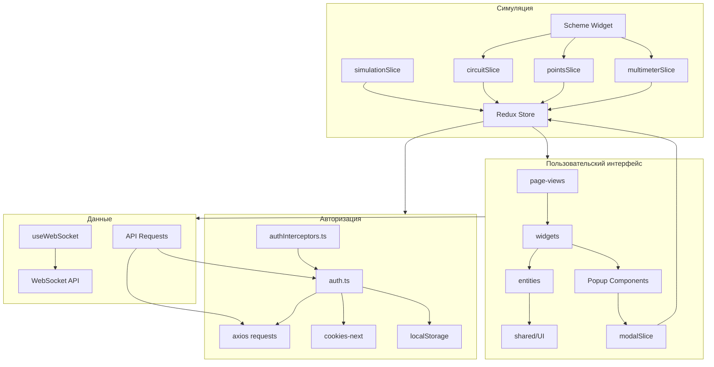
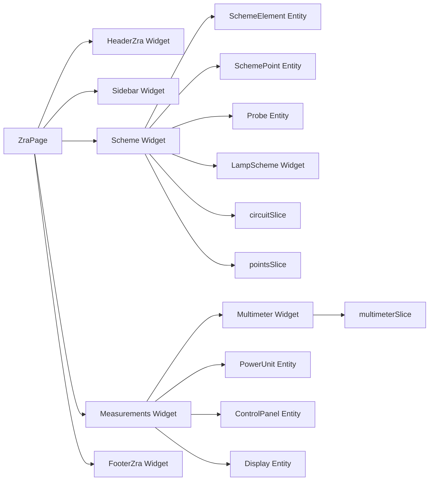
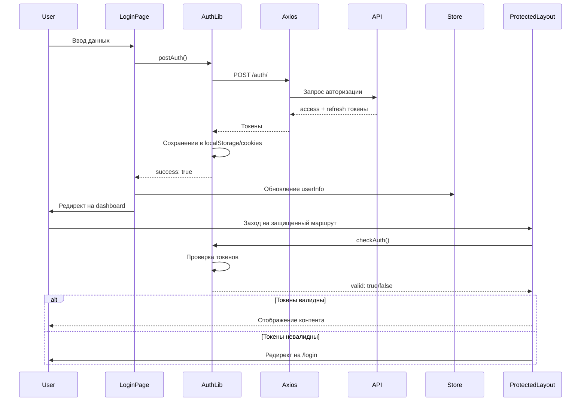
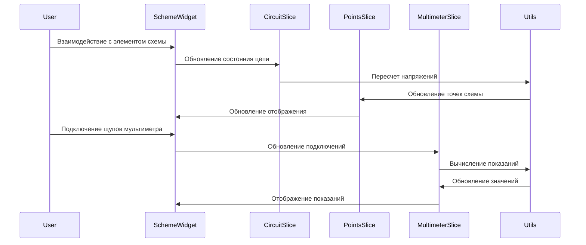

# Архитектура проекта SMS (Skill Management System)

## Обзор

Проект построен на базе **Next.js 15** с **App Router** и использует **Feature-Sliced Design (FSD)** архитектуру с модификациями. Основные технологии: TypeScript, SCSS, Redux Toolkit, axios.

## Структура проекта

### Архитектурные слои

#### 1. `app/` - Next.js App Router маршрутизация

-   Группировка маршрутов через Route Groups: `(auth)`, `(dashboard)`, `(protected)`
-   `StoreProvider` оборачивает всё приложение
-   Layout компоненты для защиты маршрутов
-   Файловая система маршрутизации Next.js 15

**Основные файлы:**

-   `layout.tsx` - корневой layout с StoreProvider
-   `StoreProvider.tsx` - Redux Provider wrapper с PersistGate
-   `(protected)/layout.tsx` - защищенный layout с AuthGuard
-   `(auth)/login/page.tsx`, `(auth)/recovery/page.tsx` - публичные маршруты
-   `(dashboard)/admin/page.tsx`, `(dashboard)/student/page.tsx`, `(dashboard)/teacher/page.tsx` - дашборды

#### 2. `page-views/` - Страницы приложения (Features)

Компоненты страниц, которые используют виджеты для композиции UI:

-   **Публичные страницы**: Landing, Login, Recovery, Policy
-   **Дашборды**: Admin-page, Student-page, Teacher-page
-   **Симуляторы**: Boiler-unit, Turbine-unit, ZRA, Training

**Особенности:**

-   Страницы являются точками входа для маршрутов
-   Используют виджеты и сущности для построения UI
-   Подключаются к Redux store через хуки

#### 3. `widgets/` - Сложные составные компоненты

Комплексные UI компоненты, объединяющие несколько сущностей:

-   **Навигация**: HeaderPtk, HeaderZra, HeaderTraining, FooterPtk, FooterZra, Sidebar
-   **Модальные окна**: PopupActuator, PopupClamp, PopupGateControl, PopupSetSimulation и др.
-   **Симуляторы**: Scheme (электрическая схема), Multimeter, Measurements
-   **Специализированные компоненты**: KA*\* (контакторы), TA*\* (трансформаторы)
-   **Формы**: Form, FormRecovery, FormRecoveryPassword, FormMalfunction
-   **Списки**: DropListElements, DropListMalfunction, ListMalfunction

#### 4. `entities/` - Бизнес-сущности

Переиспользуемые компоненты бизнес-логики:

-   **Компоненты симуляторов**: PowerUnit, Probe, GateWindow, InputCircuitBreaker, OperatorPanel
-   **Отображение данных**: Display, CodeDisplay, Timer, DateTime, ControlPanel
-   **Пользователи**: UserCard, StudentCard
-   **Элементы схемы**: SchemeElement, SchemePoint
-   **Модальные окна**: PopupRecoveryPassword, PopupRegistrationDone
-   **Обертка**: WindowWrapper

#### 5. `shared/` - Переиспользуемый код

Общие модули, используемые во всех слоях:

**`UI/`** - Базовые UI компоненты (154 файла):

-   Button, Input, Checkbox, Toast, Tooltip, Loader
-   Tumbler, Switcher, Gate, LampIndicator, Actuator
-   Marker, Provod, ScrewConnection, Tdm, Window
-   Иконки (92 файла в `icons/`)

**`hooks/`** - Кастомные хуки (37 файлов):

-   `useAuth` - авторизация
-   `useModal` - управление модальными окнами
-   `useWebSocket` - WebSocket соединение
-   `useMultimeterKnob` - управление мультиметром
-   `useGateControlButtons` - управление задвижкой
-   И многие другие специализированные хуки

**`lib/`** - Библиотеки:

-   `auth.ts` - авторизация и аутентификация
-   `authInterceptors.ts` - Axios interceptors для токенов
-   `registration.ts` - регистрация пользователей
-   `passwordRecovery.ts` - восстановление пароля
-   `probeTipCollisionDetection.ts` - определение столкновений щупов

**`utils/`** - Утилиты (25 файлов):

-   Работа с данными: `getUsers`, `getSimulations`, `getStatistics`
-   Вычисления: `getPowerUnitReadings`, `getResistanceByKind`, `setPointsVoltage`
-   Валидация и преобразования: `doFirstLatterBig`, `extractMalfunctionIds`

**`types/`** - TypeScript типы (20 файлов):

-   Определения для всех основных сущностей проекта
-   Типы для API запросов и ответов
-   Типы для компонентов и конфигураций

**`configs/`** - Конфигурации (32 файла):

-   `routes.ts` - маршруты и роли пользователей
-   `scheme.ts`, `circuit.ts` - конфигурации электрических схем
-   `multimeter.ts`, `gate.ts` - конфигурации оборудования
-   `malfunctionTemplates.ts` - шаблоны неисправностей

**`scss/`** - Общие стили:

-   `_variables.module.scss` - переменные
-   `_mixins.module.scss` - миксины

#### 6. `store/` - Redux Toolkit состояние

Управление глобальным состоянием приложения:

**Slices (12 модулей):**

-   `simulationSlice` - состояние симуляций
-   `gateSlice` - состояние задвижки
-   `modalSlice` - состояние модальных окон
-   `multimeterSlice` - состояние мультиметра
-   `circuitSlice` - состояние электрической цепи
-   `pointsSlice` - состояние точек схемы
-   `powerUnitSlice` - состояние силового агрегата
-   `trainingSlice` - состояние тренировок
-   `windowsSlice` - состояние окон измерений
-   `percentSlice` - процентные показатели
-   `updateListSlice` - обновления списков
-   `userInfoSlice` - информация о пользователе

**Особенности:**

-   Redux Persist сохраняет `windows`, `percent`, `simulation` в localStorage
-   Типизированные хуки: `useAppDispatch`, `useAppSelector`
-   Async actions через `createAsyncThunk` (в `actions/multimiter/`)

## Диаграммы архитектуры

### Redux Store структура



### Архитектурные слои FSD



### Роутинг Next.js

```mermaid
graph LR
    Root[RootLayout] --> StoreProvider[StoreProvider]
    StoreProvider --> AuthGroup[(auth) Group]
    StoreProvider --> DashboardGroup[(dashboard) Group]
    StoreProvider --> ProtectedGroup[(protected) Group]

    AuthGroup --> Login[/login]
    AuthGroup --> Recovery[/recovery]
    AuthGroup --> Policy[/policy]

    DashboardGroup --> Admin[/admin]
    DashboardGroup --> Student[/student]
    DashboardGroup --> Teacher[/teacher]

    ProtectedGroup --> ProtectedLayout[ProtectedLayout]
    ProtectedLayout --> AuthGuard[AuthGuard]
    ProtectedLayout --> Dnd[Dnd]
    ProtectedLayout --> ModalWrapper[ModalWrapper]

    ProtectedLayout --> Ptk[/ptk]
    ProtectedLayout --> Training[/training]
    ProtectedLayout --> Zra[/zra]
    ProtectedLayout --> Boiler[/ptk/boiler]
    ProtectedLayout --> Stats[/stats]
    ProtectedLayout --> Survey[/survey]

    Root --> Landing[/]
    Root --> Simulation[/simulation/id]
```

### Основные модули и их взаимодействие



### Пример композиции страницы ZRA



## Потоки данных

### Авторизация и аутентификация



### Работа с симуляцией



## Ключевые файлы

### Конфигурация и настройка

-   **`src/store/store.ts`** - Конфигурация Redux store с persist
-   **`src/app/layout.tsx`** - Root layout с StoreProvider
-   **`src/app/StoreProvider.tsx`** - Redux Provider wrapper с PersistGate
-   **`next.config.ts`** - Конфигурация Next.js с webpack для SVG
-   **`tsconfig.json`** - TypeScript конфигурация с path aliases

### Авторизация

-   **`src/shared/lib/auth.ts`** - Функции авторизации и аутентификации
-   **`src/shared/lib/authInterceptors.ts`** - Axios interceptors для автоматической обработки токенов
-   **`src/shared/hooks/useAuth.ts`** - Хук для работы с авторизацией
-   **`src/app/(protected)/layout.tsx`** - Защищенный layout с AuthGuard

### Маршрутизация

-   **`src/shared/configs/routes.ts`** - Конфигурация маршрутов и ролей пользователей
-   **`src/app/(auth)/login/page.tsx`** - Страница входа
-   **`src/app/(dashboard)/admin/page.tsx`** - Дашборд администратора
-   **`src/app/(protected)/ptk/page.tsx`** - Страница ПТК (симулятор)

### Симуляторы

-   **`src/widgets/Scheme/index.tsx`** - Компонент электрической схемы
-   **`src/store/circuitSlice.ts`** - Состояние электрической цепи
-   **`src/store/pointsSlice.ts`** - Состояние точек схемы
-   **`src/store/multimeterSlice.ts`** - Состояние мультиметра
-   **`src/store/simulationSlice.ts`** - Состояние симуляций

### Утилиты и вспомогательные функции

-   **`src/shared/utils/setPointsVoltage/index.ts`** - Пересчет напряжений в точках схемы
-   **`src/shared/utils/getPowerUnitReadings/index.ts`** - Получение показаний силового агрегата
-   **`src/shared/lib/probeTipCollisionDetection.ts`** - Определение столкновений щупов

## Особенности реализации

### 1. Redux Persist

Сохраняет состояние `windows`, `percent`, `simulation` в localStorage для восстановления при перезагрузке страницы:

```typescript
const persistConfig = {
	key: 'appWindows',
	storage,
	whitelist: ['windows', 'percent', 'simulation'],
};
```

### 2. Axios Interceptors

Автоматическая обработка access токенов через interceptors с реализацией refresh token механизма:

**Request Interceptor** (`setupRequestInterceptor`):

-   Автоматически добавляет `Authorization: Bearer {token}` заголовок в каждый запрос
-   Использует глобальную переменную `accessToken` для хранения токена в памяти

**Response Interceptor** (`setupResponseInterceptor`):

-   Перехватывает ответы с кодом 401 (Unauthorized)
-   Автоматически обновляет токен через `/auth/refresh/` endpoint
-   Реализует очередь запросов для предотвращения множественных refresh запросов
-   Повторяет оригинальный запрос с новым токеном
-   Выполняет logout при неудачном обновлении токена

**Особенности реализации:**

-   Защита от race condition через флаг `isRefreshing` и очередь `failedQueue`
-   Избежание бесконечных циклов через флаг `_retry` в конфигурации запроса
-   Автоматическая обработка всех запросов без ручного добавления токенов

📖 **Подробная документация**: [docs/AXIOS_INTERCEPTORS.md](docs/AXIOS_INTERCEPTORS.md)

### 3. Route Groups

Организация маршрутов по функциональности через скобки в названиях папок:

-   `(auth)` - публичные маршруты
-   `(dashboard)` - дашборды по ролям
-   `(protected)` - защищенные маршруты с проверкой авторизации

### 4. Type-Safe Hooks

Типизированные хуки для работы со store:

```typescript
export const useAppDispatch = useDispatch.withTypes<AppDispatch>();
export const useAppSelector = useSelector.withTypes<RootState>();
```

### 5. SVG как React компоненты

Конфигурация webpack через `@svgr/webpack` для импорта SVG как React компонентов:

```typescript
import Logo from '@/public/svg/logo.svg';
```

### 6. Static Export

Next.js настроен на статический экспорт (`output: 'export'`), что позволяет деплоить на статические хостинги.

### 7. Модульная стилизация

Использование SCSS Modules для изоляции стилей компонентов:

```typescript
import styles from './styles.module.scss';
```

## Технологический стек

### Core

-   **Next.js 15.1.6** - React фреймворк с App Router
-   **React 19.0.0** - UI библиотека
-   **TypeScript 5** - Типизация

### State Management

-   **@reduxjs/toolkit 2.5.1** - Управление состоянием
-   **react-redux 9.2.0** - React bindings для Redux
-   **redux-persist 6.0.0** - Сохранение состояния

### HTTP & WebSocket

-   **axios 1.11.0** - HTTP клиент
-   **WebSocket API** - Real-time коммуникация (через кастомный хук)

### UI & Styling

-   **SASS 1.89.1** - Препроцессор CSS
-   **@dnd-kit/core 6.3.1** - Drag & Drop
-   **simplebar-react 3.3.2** - Кастомные скроллбары
-   **swiper 12.0.3** - Слайдеры
-   **classnames 2.5.1** - Условные классы

### Утилиты

-   **cookies-next 6.1.0** - Работа с cookies
-   **react-responsive 10.0.1** - Адаптивность

### Testing & Development

-   **Jest 29.7.0** - Unit тесты
-   **@testing-library/react 16.2.0** - Тестирование компонентов
-   **Playwright** - E2E тестирование
-   **Storybook 8.6.11** - Документация компонентов
-   **ESLint** - Линтинг
-   **Husky 9.1.7** - Git hooks

## Принципы архитектуры

### SOLID

-   **Single Responsibility** - Каждый компонент/модуль отвечает за одну задачу
-   **Open/Closed** - Расширение через композицию, не изменяя существующий код
-   **Liskov Substitution** - Правильное использование наследования и полиморфизма
-   **Interface Segregation** - Узкие интерфейсы для компонентов
-   **Dependency Inversion** - Зависимость от абстракций (hooks, utils)

### KISS (Keep It Simple, Stupid)

-   Простые и понятные компоненты
-   Минимизация вложенности
-   Явные зависимости
-   Понятные названия

### Feature-Sliced Design

Проект следует принципам FSD с адаптацией под Next.js:

-   **Разделение по слоям**: app → page-views → widgets → entities → shared
-   **Правила импорта**: слои могут импортировать только из нижележащих слоев
-   **Изоляция**: каждый модуль независим и переиспользуем
-   **Масштабируемость**: легко добавлять новые фичи

## Структура директорий

```
src/
├── app/                    # Next.js App Router
│   ├── (auth)/            # Публичные маршруты
│   ├── (dashboard)/       # Дашборды
│   ├── (protected)/       # Защищенные маршруты
│   └── simulation/        # Динамические маршруты
├── page-views/            # Страницы (Features)
├── widgets/               # Сложные компоненты
├── entities/              # Бизнес-сущности
├── shared/                # Переиспользуемый код
│   ├── UI/               # Базовые компоненты
│   ├── hooks/            # Кастомные хуки
│   ├── lib/              # Библиотеки
│   ├── utils/            # Утилиты
│   ├── types/            # TypeScript типы
│   ├── configs/          # Конфигурации
│   └── scss/             # Общие стили
└── store/                 # Redux store
    ├── actions/          # Async actions
    └── *.slice.ts        # Redux slices
```

## Расширение проекта

### Добавление новой страницы

1. Создать компонент страницы в `src/page-views/new-page/`
2. Добавить маршрут в `src/app/new-route/page.tsx`
3. Использовать виджеты и сущности для композиции

### Добавление нового виджета

1. Создать директорию в `src/widgets/new-widget/`
2. Использовать entities и shared/UI компоненты
3. Подключиться к store через хуки при необходимости

### Добавление нового slice

1. Создать файл `src/store/newSlice.ts`
2. Использовать `createSlice` из RTK
3. Добавить в `rootReducer` в `src/store/store.ts`
4. При необходимости добавить в `whitelist` для persist

### Добавление нового API endpoint

1. Создать функцию в `src/shared/lib/` или `src/shared/utils/`
2. Использовать axios с interceptors (токены добавляются автоматически)
3. Добавить типы в `src/shared/types/`

## Заключение

Проект использует современный стек технологий и следует лучшим практикам разработки:

-   ✅ Четкая архитектура с разделением ответственности
-   ✅ Типобезопасность на всех уровнях
-   ✅ Модульность и переиспользуемость кода
-   ✅ Масштабируемость и поддерживаемость
-   ✅ Современные инструменты разработки и тестирования

Архитектура позволяет легко расширять функционал, добавлять новые фичи и поддерживать код в актуальном состоянии.
