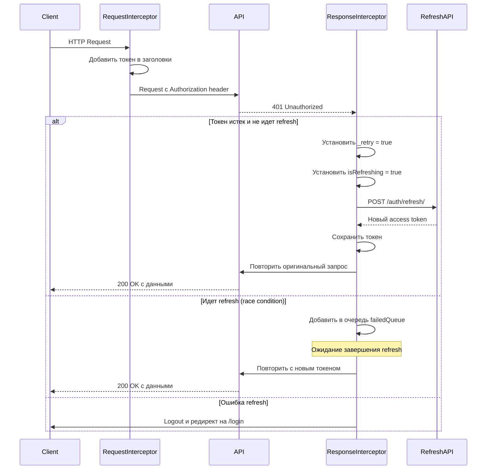
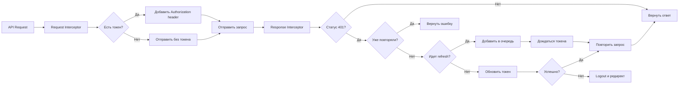

# Axios Interceptors - Детальная документация

## Обзор

В проекте реализована автоматическая обработка JWT токенов через Axios Interceptors. Это позволяет:

-   Автоматически добавлять токен во все запросы
-   Автоматически обновлять токен при истечении
-   Обрабатывать ошибки авторизации централизованно

## Структура файлов

```
src/shared/lib/
├── authInterceptors.ts  # Основная логика interceptors
└── auth.ts              # Инициализация и использование
```

## Код реализации

```112:127:src/shared/lib/authInterceptors.ts
// Устанавливаем интерцептор для добавления токена в запросы
export const setupRequestInterceptor = () => {
    axios.interceptors.request.use(
        (config: InternalAxiosRequestConfig) => {
            if (accessToken && config.headers) {
                config.headers.Authorization = `Bearer ${accessToken}`;
            }
            return config;
        },
        (error: AxiosError) => Promise.reject(error)
    );
};

export const initializeInterceptors = (urlBase: string): void => {
    setupRequestInterceptor();
    setupResponseInterceptor(urlBase);
};
```

## Request Interceptor

Request Interceptor автоматически добавляет токен доступа в заголовки всех HTTP запросов.

### Реализация

```112:122:src/shared/lib/authInterceptors.ts
// Устанавливаем интерцептор для добавления токена в запросы
export const setupRequestInterceptor = () => {
    axios.interceptors.request.use(
        (config: InternalAxiosRequestConfig) => {
            if (accessToken && config.headers) {
                config.headers.Authorization = `Bearer ${accessToken}`;
            }
            return config;
        },
        (error: AxiosError) => Promise.reject(error)
    );
};
```

### Как это работает

1. **Проверка токена**: Перед каждым запросом проверяется наличие `accessToken` в памяти
2. **Добавление заголовка**: Если токен существует, добавляется заголовок `Authorization: Bearer {token}`
3. **Модификация конфига**: Конфигурация запроса модифицируется и возвращается

### Пример использования

При вызове любого axios запроса токен добавляется автоматически:

```typescript
// Токен будет добавлен автоматически через interceptor
const users = await axios.get('/users/');
// Запрос уйдет с заголовком: Authorization: Bearer eyJhbGc...
```

## Response Interceptor

Response Interceptor обрабатывает ответы сервера и автоматически обновляет токен при получении 401 ошибки.

### Реализация

```39:108:src/shared/lib/authInterceptors.ts
export const setupResponseInterceptor = (urlBase: string) => {
    axios.interceptors.response.use(
        (response: AxiosResponse) => response,
        async (error: AxiosError) => {
            const originalRequest = error.config as ExtendedAxiosRequestConfig;

            if (originalRequest.url?.includes('/auth/refresh')) {
                logout();
                return Promise.reject(error);
            }

            if (error.response?.status === 401 && !originalRequest._retry) {
                if (isRefreshing) {
                    return new Promise<string | null>((resolve, reject) => {
                        failedQueue.push({ resolve, reject });
                    })
                        .then((token) => {
                            if (token && originalRequest.headers) {
                                originalRequest.headers.Authorization = `Bearer ${token}`;
                            }
                            return axios(originalRequest);
                        })
                        .catch((err) => Promise.reject(err));
                }

                originalRequest._retry = true;
                isRefreshing = true;

                try {
                    const refreshToken = getCookie('refreshToken');
                    if (!refreshToken) {
                        throw new Error('Не получен refresh token');
                    }

                    const refreshRes = await axios.post<RefreshResponse>(
                        `${urlBase}/auth/refresh/`,
                        { refresh: refreshToken }
                    );

                    if (refreshRes.status === 200 && refreshRes.data.access) {
                        const newAccessToken = refreshRes.data.access;

                        // Сохраняем в памяти
                        setAccessToken(newAccessToken);
                        localStorage.setItem('accessToken', newAccessToken);

                        // Обновляем заголовок для оригинального запроса
                        if (originalRequest.headers) {
                            originalRequest.headers.Authorization = `Bearer ${newAccessToken}`;
                        }

                        // Обрабатываем очередь запросов
                        processQueue(null, newAccessToken);

                        return axios(originalRequest);
                    }
                    throw new Error('Ошибка получения refresh token');
                } catch (refreshError) {
                    processQueue(refreshError, null);
                    logout();
                    window.location.href = '/login';
                    return Promise.reject(refreshError);
                } finally {
                    isRefreshing = false;
                }
            }
            return Promise.reject(error);
        }
    );
};
```

### Алгоритм работы



### Защита от race condition

Для предотвращения множественных одновременных refresh запросов используется механизм очереди:

```12:28:src/shared/lib/authInterceptors.ts
interface FailedRequest {
    resolve: (value: string | null) => void;
    reject: (error: unknown) => void;
}

let failedQueue: FailedRequest[] = [];

const processQueue = (error: unknown, token: string | null = null) => {
    failedQueue.forEach(({ resolve, reject }) => {
        if (error) {
            reject(error);
        } else {
            resolve(token);
        }
    });
    failedQueue = [];
};
```

**Как это работает:**

1. **Флаг `isRefreshing`**: Показывает, идет ли процесс обновления токена
2. **Очередь `failedQueue`**: Хранит промисы для запросов, ожидающих обновления токена
3. **`processQueue`**: Обрабатывает все запросы в очереди после успешного обновления токена

### Защита от бесконечных циклов

Используется флаг `_retry` в конфигурации запроса:

```30:33:src/shared/lib/authInterceptors.ts
// Расширяем тип AxiosRequestConfig для добавления кастомного поля
interface ExtendedAxiosRequestConfig extends InternalAxiosRequestConfig {
    _retry?: boolean;
}
```

Если запрос уже был повторен (`_retry === true`), он не будет обработан повторно.

### Обработка ошибок refresh

Если обновление токена не удалось:

```96:100:src/shared/lib/authInterceptors.ts
                } catch (refreshError) {
                    processQueue(refreshError, null);
                    logout();
                    window.location.href = '/login';
                    return Promise.reject(refreshError);
```

1. Все запросы в очереди получают ошибку
2. Выполняется logout (очистка токенов)
3. Происходит редирект на страницу входа

## Инициализация

Interceptors инициализируются при загрузке модуля `auth.ts`:

```6:10:src/shared/lib/auth.ts
const urlBase = process.env.NEXT_PUBLIC_API_BASE_URL;

if (urlBase) {
	initializeInterceptors(urlBase);
}
```

Это гарантирует, что interceptors установлены до любого API запроса.

## Управление токеном в памяти

Токен хранится в глобальной переменной для быстрого доступа:

```7:37:src/shared/lib/authInterceptors.ts
export let accessToken: string | null = null;

// Интерцептор для автоматического обновления токенов
let isRefreshing = false;

interface FailedRequest {
    resolve: (value: string | null) => void;
    reject: (error: unknown) => void;
}

let failedQueue: FailedRequest[] = [];

const processQueue = (error: unknown, token: string | null = null) => {
    failedQueue.forEach(({ resolve, reject }) => {
        if (error) {
            reject(error);
        } else {
            resolve(token);
        }
    });
    failedQueue = [];
};

// Расширяем тип AxiosRequestConfig для добавления кастомного поля
interface ExtendedAxiosRequestConfig extends InternalAxiosRequestConfig {
    _retry?: boolean;
}

export const setAccessToken = (token: string | null): void => {
    accessToken = token;
};
```

При логине токен сохраняется и в localStorage, и в памяти:

```50:52:src/shared/lib/auth.ts
		if (response.statusText == 'OK') {
			setAccessToken(access);
			localStorage.setItem('accessToken', access);
```

При инициализации приложения токен загружается из localStorage:

```18:21:src/shared/lib/auth.ts
export function initAccessFromStorage() {
	const stored = localStorage.getItem('accessToken');
	if (stored) setAccessToken(stored);
}
```

## Примеры использования

### Базовый запрос

```typescript
// Токен добавляется автоматически через interceptor
const response = await axios.get('/users/');
```

### Запрос с обработкой ошибок

```typescript
try {
	const users = await axios.get('/users/');
	// Если токен истек, он будет обновлен автоматически
	// и запрос повторен
	return users.data;
} catch (error) {
	// Ошибки, не связанные с авторизацией, обрабатываются здесь
	if (axios.isAxiosError(error) && error.response?.status !== 401) {
		throw error;
	}
}
```

### Пример из проекта

```6:17:src/shared/utils/getUsers/getUsers.ts
export async function getUsers(): Promise<User[]> {
	try {
		const response = await axios.get<User[]>(`${urlBase}/users/`);
		return response.data;
	} catch (error) {
		const axiosError = error as AxiosError;
		const message = axiosError.response?.data
			? JSON.stringify(axiosError.response.data)
			: 'Failed to fetch';
		throw new Error(message);
	}
}
```

В этом примере:

-   Токен добавляется автоматически
-   При истечении токен обновляется автоматически
-   Запрос повторяется с новым токеном
-   Разработчик получает результат или ошибку бизнес-логики

## Поток данных



## Преимущества реализации

### 1. Централизованная обработка

Все запросы проходят через единую точку обработки токенов, что упрощает поддержку и отладку.

### 2. Прозрачность для разработчика

Разработчику не нужно заботиться о добавлении токенов вручную - это происходит автоматически.

### 3. Автоматическое обновление

Токены обновляются автоматически без необходимости ручного управления.

### 4. Защита от race condition

Очередь запросов предотвращает множественные одновременные refresh запросы.

### 5. Обработка ошибок

Централизованная обработка ошибок авторизации с автоматическим logout.

## Тестирование

### Мок для тестирования

При тестировании можно отключить interceptors или использовать моки:

```typescript
// В тестах
jest.mock('@/shared/lib/authInterceptors', () => ({
	initializeInterceptors: jest.fn(),
	setAccessToken: jest.fn(),
}));
```

### Проверка работы

1. **Проверка добавления токена**: Убедиться, что заголовок `Authorization` присутствует
2. **Проверка refresh**: Симулировать 401 и проверить автоматическое обновление
3. **Проверка очереди**: Убедиться, что параллельные запросы обрабатываются корректно

## Ограничения и известные проблемы

### 1. Refresh endpoint должен быть доступен

Если endpoint `/auth/refresh/` недоступен, все запросы после истечения токена будут приводить к logout.

### 2. Refresh token в cookies

Refresh token хранится в cookies через `cookies-next`. Необходимо убедиться, что cookies доступны.

### 3. SSR (Server-Side Rendering)

На сервере нет доступа к `localStorage` и `window.location`. Interceptors работают только на клиенте.

## Рекомендации

### Для новых API запросов

Используйте стандартный `axios` - токены добавляются автоматически:

```typescript
// ✅ Правильно - токен добавится автоматически
const data = await axios.get('/api/endpoint');

// ❌ Неправильно - токен уже есть, дублировать не нужно
const data = await axios.get('/api/endpoint', {
	headers: { Authorization: `Bearer ${token}` },
});
```

### Для публичных endpoints

Если endpoint не требует авторизации и токен не должен добавляться, можно использовать отдельный экземпляр axios или явно удалить заголовок (но это редкий случай).

### Для WebSocket соединений

WebSocket соединения не используют Axios interceptors. Токен передается в URL параметре:

```7:14:src/shared/hooks/useWebSocket.ts
	useEffect(() => {
		const token = localStorage.getItem('accessToken'); // 👈 Получаем токен из localStorage
		const wsURL = process.env.NEXT_PUBLIC_WS_URL;

		if (typeof window === 'undefined' || !token) return;

		wsRef.current = new WebSocket(
			`${wsURL}/?token=${token}`,
		);
```

## Заключение

Реализация Axios Interceptors в проекте обеспечивает:

-   ✅ Автоматическое управление токенами
-   ✅ Прозрачную работу для разработчиков
-   ✅ Надежную обработку ошибок
-   ✅ Защиту от race conditions
-   ✅ Централизованную логику авторизации

Это позволяет разработчикам сосредоточиться на бизнес-логике, не думая о деталях управления токенами.
