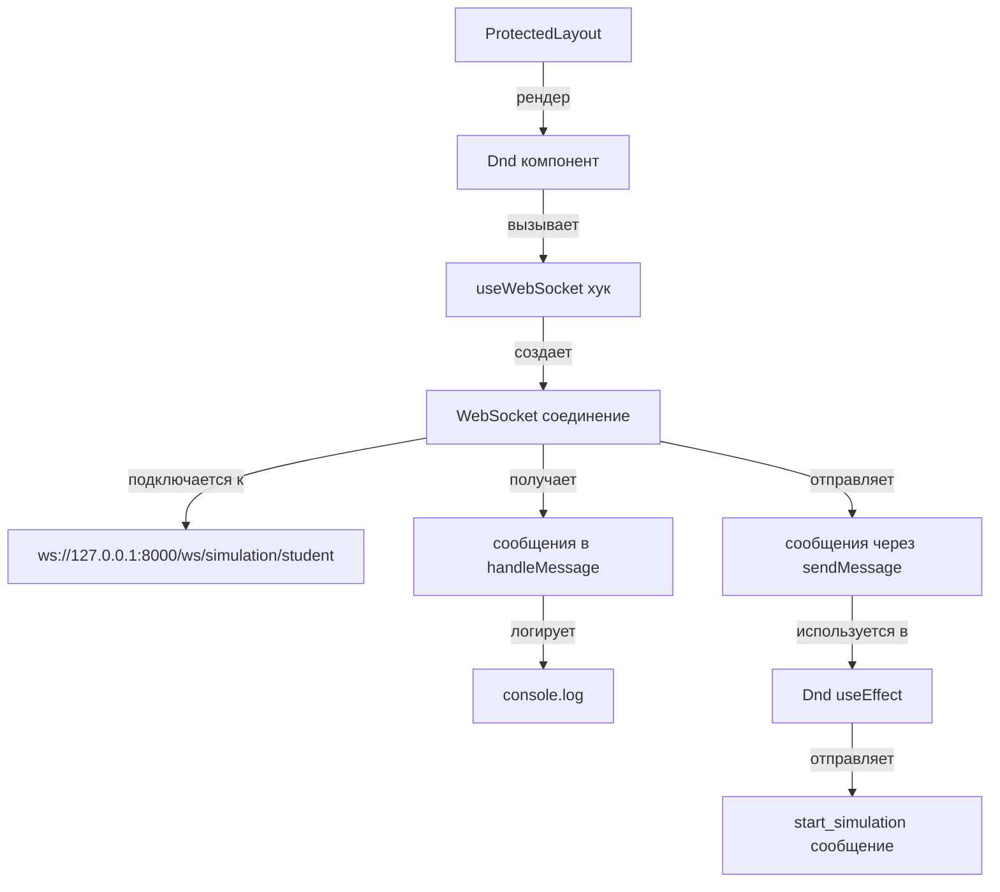

# Анализ и улучшение WebSocket

## Текущая архитектура

### Компоненты:

1. **`src/shared/hooks/useWebSocket.ts`** - основной хук для WebSocket соединения
2. **`src/widgets/Dnd/index.tsx`** - использует WebSocket для отправки сообщений
3. **`src/app/(protected)/layout.tsx`** - оборачивает защищенные страницы в Dnd компонент

### Текущий поток работы:

## Выявленные проблемы

### 1. **Нет обработки входящих сообщений**

- Сообщения только логируются в консоль (`console.log('Received message:', event.data)`)
- Нет парсинга JSON
- Нет диспатча действий в Redux store
- Нет обновления состояния приложения на основе сообщений

### 2. **Нет автоматического переподключения**

- При разрыве соединения WebSocket не восстанавливается
- Нет логики retry с экспоненциальной задержкой
- Нет обработки кодов закрытия соединения

### 3. **Проблема с множественными экземплярами**

- Каждый компонент, использующий `useWebSocket`, создает новое соединение
- Нет singleton паттерна для WebSocket
- Может привести к множественным соединениям с сервером

### 4. **Отправка сообщений до установки соединения**

- В `Dnd/index.tsx` сообщение отправляется сразу в `useEffect`
- Соединение может быть еще не установлено (`readyState !== OPEN`)
- `sendMessage` проверяет состояние, но нет очереди сообщений

### 5. **Нет обработки ошибок и состояний**

- Ошибки только логируются
- Нет уведомлений пользователю
- Нет обработки различных типов ошибок (сеть, авторизация, сервер)

### 6. **Зависимость от пустого массива зависимостей**

- `useEffect` с `[]` означает, что соединение создается только один раз
- Если токен изменится, соединение не пересоздастся
- Нет реакции на изменение `NEXT_PUBLIC_WS_URL`

### 7. **Нет типизации сообщений**

- Сообщения не типизированы
- Нет интерфейсов для входящих/исходящих сообщений
- Сложно поддерживать и расширять

## Предлагаемые улучшения

### 1. Создать централизованный WebSocket менеджер

- Singleton паттерн для одного соединения на приложение
- Очередь сообщений для отправки до установки соединения
- Автоматическое переподключение с экспоненциальной задержкой

### 2. Добавить обработку входящих сообщений

- Парсинг JSON сообщений
- Типизация сообщений (TypeScript интерфейсы)
- Диспатч действий в Redux на основе типа сообщения
- Обработка различных типов сообщений (gate_position, circuit_update, etc.)

### 3. Улучшить обработку ошибок

- Обработка различных типов ошибок
- Уведомления пользователю через toast
- Логирование ошибок для отладки

### 4. Добавить состояния соединения

- Отслеживание состояния (connecting, connected, disconnected, error)
- Возможность подписки на изменения состояния
- Индикатор статуса соединения в UI

### 5. Типизация сообщений

- Интерфейсы для всех типов сообщений
- Валидация входящих сообщений
- Автодополнение в IDE

## План проверки

1. Проверить работу соединения в браузере (DevTools → Network → WS)
2. Проверить отправку сообщений (открыть консоль, проверить логи)
3. Проверить получение сообщений (симуляция сообщения от сервера)
4. Проверить переподключение (отключить сеть, включить обратно)
5. Проверить обработку ошибок (неверный URL, неверный токен)

## Файлы для изменения

- `src/shared/hooks/useWebSocket.ts` - основной хук (требует рефакторинга)
- `src/widgets/Dnd/index.tsx` - использование WebSocket (требует обновления)
- Новый файл: `src/shared/lib/websocket/WebSocketManager.ts` - централизованный менеджер
- Новый файл: `src/shared/types/websocket.ts` - типы сообщений